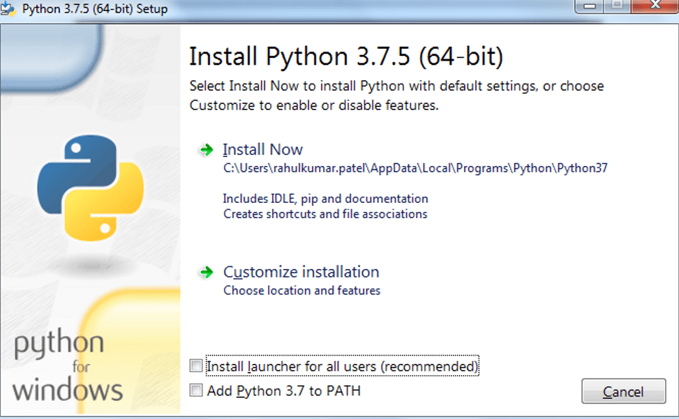
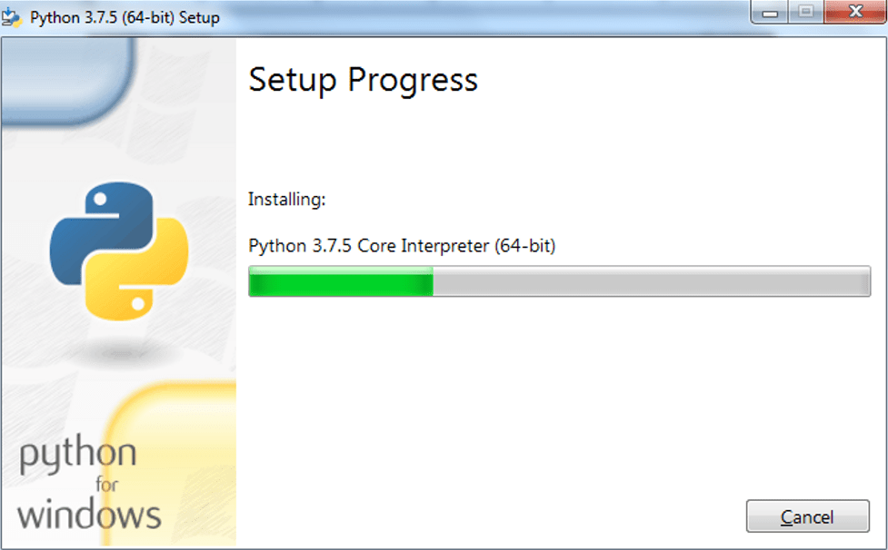

# Very Basic Python Learning Guide.
Disclaimer: This article is based on my personal opinion and does not reflect best practice.

Python is very easy to learn programming language. As per [StackOverflow developer suvey 2019](https://insights.stackoverflow.com/survey/2019), Python is the fastest-growing major programming language today. [Python outranked Java as the second most popular language on GitHub by repository contributors](https://octoverse.github.com/) in late 2019.

But when it comes to setting up pyton on windows for begginers, it is little difficult. Lets make it easy.

## Setting up Python Environment on Windows 7/10

### Download python
The latest python is pyton 3.8.1 but we should use python 3.7 version. python 3.7.6 is latest stable version. Download it from below links. 64 bit version is reccomended. If you are confused use universal 32 bit version.

[64bit](https://www.python.org/ftp/python/3.7.6/python-3.7.6-amd64.exe)

[32bit](https://www.python.org/ftp/python/3.7.6/python-3.7.6.exe)

For more information visit [official site](https://www.python.org/downloads)

### Install python
Note: The images aer for python 3.7.5, it aplies to python 3.7.6

If you have admin rights (your personal PC), install with default settings.


If you do not have admin rights (work pc), uncheck `Install launcher for all users (recommended)`






### Create virtual environment and install development libraries
Python installed system vide should not be used for development and testing. You should always use python virtual environments so that if anything goes wrong, your system installation is not affected.

If python is installed with default settings it will be installed in `%LOCALAPPDATA%\Programs\Python\Python37`

Open windows command prompt (press win key and type cmd then enter).
By default, it will be opened in home directory (Type `cd %userprofile%` if you want to make sure). Type following commands after that. Please note that every line is prefixed with `C:\Users\user.name> ` just for explanation. You only need to type (or copy/paste) text after that. For example in last line, only `dev\scripts\activate` is need to be typed not `C:\Users\user.name> dev\scripts\activate`.

```cmd
C:\Users\user.name> %LOCALAPPDATA%\Programs\Python\Python37\python.exe -venv dev
C:\Users\user.name> dev\scripts\activate
```

On successful virtual environment creation and activation your virtual name (in our case `dev`) with parenthesis will appear before path in your command window. You can close the cmd after that. Continue typing following command to install two module useful for development.

```cmd
(dev) C:\Users\user.name> pip install pylint yapf
```

It will take some time depending on your internet speed. Please do not close command prompt while installation is pending. You will be acknowledged after successful installation. You can read about [pip](https://docs.python.org/3.7/installing/index.html), [pylint](https://github.com/PyCQA/pylint) and [yapf](https://github.com/google/yapf)


### Download IDE (Integrated development environment)
[64bit](https://github.com/VSCodium/vscodium/releases/download/1.41.0/VSCodium-win32-x64-1.41.0.zip)

[32bit](https://github.com/VSCodium/vscodium/releases/download/1.41.0/VSCodium-win32-ia32-1.41.0.zip)

For more information visit [official site](https://vscodium.com/)


### Prepare IDE
- unzip `VSCodium-win32-x64-1.41.0.zip` to desired location. if possible unzip in `%LOCALAPPDATA%\Programs\vscodium`.

- install python extension for IDE
Double click `VSCodium` executable. In customize section click python install python extension. (See image for more info)


    Press ok in right hand down corner. It will take some time to install. Please do not click any more buttons if prompted.

- Select python environment
    Go to File > Preferences > Settings and type python.pythonpath

    In the input field (where python is written), replace python with your virtual environment python path. it will be `C:\Users\user.name\dev\scripts\python`. You need to change user.name with your username. If you are lazy, enough type `echo %userprofile%\dev\scripts\python` in cmd and python path will be printed. Just copy that and paste it in above field. It should look like this.
    

close settings. press ctrl + N for new file. Type `print('Hello world')`. press ctrl + S, save as hello.py to anywhere you want.

To run python program, open cmd and type following.

```cmd
C:\Users\user.name > dev\Scripts\activate
(dev) C:\Users\rahulkumar.patel > python path\to\your\hello.py
```

You need to change `path\to\your\hello.py` to real path of your above saved file.

It will be handy if you have enabled file extensions. Please click [here](How to Make Windows Show File Extensions) if you don't know how?

Thats it. Happy coding.

### Learning python

Python is very easy to learn.

[Introduction to Python on UDACITY](https://www.udacity.com/course/introduction-to-python--ud1110) is good place to start. After finishing, you should take wonderful course [Introduction to Computer Science and Programming Using Python by MITx](https://www.edx.org/course/introduction-to-computer-science-and-programming-7).

Your suggestions are welcome at any time. Please contact me at pr.rahulpatel at gmail.com
